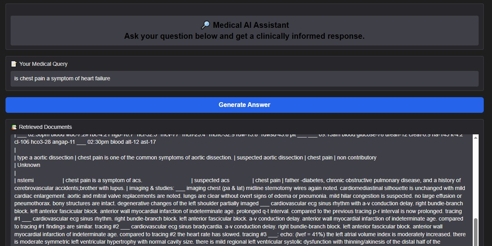
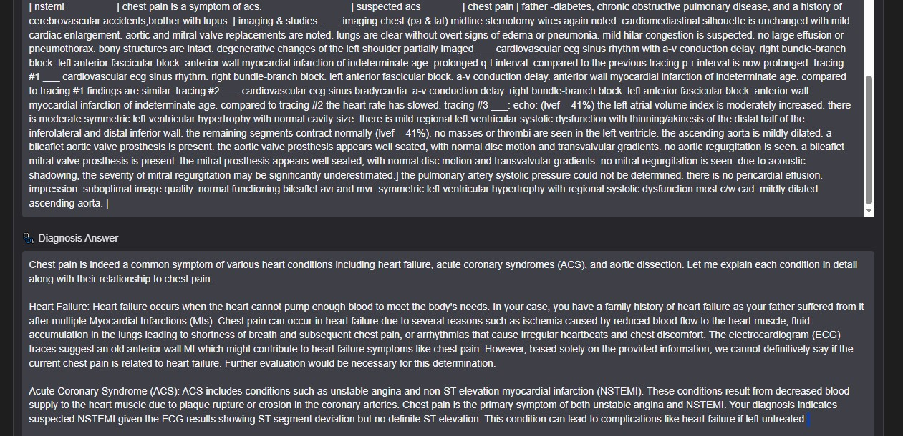

# 🩺 RAG for Diagnostic Reasoning on Clinical Notes (DiReCT)

This project builds a **Retrieval-Augmented Generation (RAG) system** for clinical diagnostic reasoning.  
It uses **FAISS** for semantic retrieval and **Mistral-7B** as the language model to generate detailed, structured diagnostic explanations.

---

## 🔑 Key Features

- 📂 **Data Preprocessing**  
  - Parses and cleans hierarchical medical JSON files (diagnosis flowcharts + patient records).  
  - Normalizes symptoms, risk factors, and lab results.  
  - Exports cleaned data as CSV files for downstream use.

- 🔍 **Semantic Retrieval with FAISS**  
  - Embedding-based search using `all-MiniLM-L6-v2`.  
  - Cosine similarity for accurate, context-rich retrieval.

- 🧠 **LLM-Powered Reasoning**  
  - Retrieval-Augmented Generation pipeline with **Mistral-7B-Instruct**.  
  - Produces **structured, medically consistent** answers with reasoning steps.

- 🧪 **Interactive Query Support**  
  - Handles natural-language queries such as:  
    *“Is chest pain a symptom of heart failure?”*  
  - Returns retrieved evidence + generated medical explanation.

---
# 📸 Screenshot  

  
  

---

## 🛠 Tech Stack

- **Language:** Python  
- **Retrieval:** FAISS, BM25 (rank-bm25)  
- **Embeddings:** SentenceTransformers (`all-MiniLM-L6-v2`)  
- **Model:** `mistralai/Mistral-7B-Instruct-v0.2` (transformers)  
- **Data Processing:** pandas, numpy, json  
- **Execution:** Google Colab  

---
